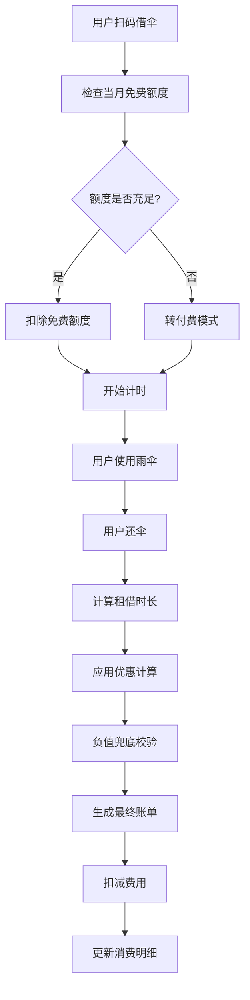
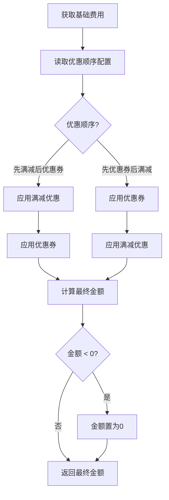

## 1. 产品概述

共享雨伞投放Web应用是一套面向城市共享出行场景的智能雨伞租赁管理系统。系统通过精细化的优惠计算、账单管理、额度管控和消费明细功能，实现雨伞租借的全流程数字化运营。

- 主要解决共享雨伞运营中的计费复杂度问题，支持多优惠叠加、额度管理、异点归还等场景
- 目标用户为共享雨伞运营商的运营管理人员和终端用户
- 产品价值在于提供精准、透明、高效的计费管理能力，降低运营成本，提升用户体验

## 2. 核心功能

### 2.1 用户角色

| 角色 | 注册方式 | 核心权限 |
|------|----------|----------|
| 运营管理员 | 账号密码登录 | 配置计费规则、优惠策略、额度参数、查看全量数据 |
| 普通用户 | 手机号注册登录 | 借还雨伞、查看账单、使用优惠券、查询消费明细 |

### 2.2 功能模块

1. **优惠计算模块**：计费规则配置、多优惠叠加计算、优惠顺序配置、负值兜底校验
2. **账单生成模块**：租借账单生成、异点归还结算、账单详情展示
3. **额度管控模块**：每月免费额度发放、周期额度重置、额度使用记录、额度不足提醒
4. **消费明细模块**：消费记录查询、优惠明细展示、账单导出

### 2.3 页面详情

| 页面名称 | 模块名称 | 功能描述 |
|----------|----------|----------|
| 仪表盘 | 数据概览 | 今日租借量、收入统计、优惠券使用情况、额度使用概览 |
| 优惠配置 | 优惠计算模块 | 计费规则配置、优惠券管理、满减活动配置、优惠顺序调整 |
| 账单管理 | 账单生成模块 | 账单列表、账单详情、异点归还结算处理 |
| 额度管理 | 额度管控模块 | 用户额度查询、额度发放记录、重置规则配置 |
| 消费明细 | 消费明细模块 | 消费记录列表、优惠明细、导出功能 |
| 借还雨伞 | 用户端功能 | 扫码借伞、还伞结算、费用预览 |

## 3. 核心流程

### 3.1 用户借伞流程

用户扫码借伞 → 系统检查用户当月免费额度 → 额度充足则扣除额度 → 开始计时计费 → 用户使用雨伞 → 用户还伞 → 系统计算租借时长 → 应用优惠计算（优惠券+满减）→ 负值兜底校验 → 生成最终账单 → 扣减费用 → 更新消费明细

### 3.2 优惠计算流程

获取基础费用 → 按配置顺序应用优惠 → 先满减后优惠券/先优惠券后满减 → 计算最终金额 → 检查是否为负值 → 负值则置为0 → 返回最终金额

## 4. 用户界面设计

### 4.1 设计风格

- **主色调**：深海蓝 (#0F4C81) - 代表信任、专业
- **辅助色**：晴天蓝 (#4FC3F7) - 代表雨伞、晴朗
- **强调色**：活力橙 (#FF9800) - 用于优惠、提醒等重要信息
- **中性色**：深灰 (#333333)、中灰 (#666666)、浅灰 (#F5F5F5)
- **按钮风格**：圆角4px，轻微阴影，hover时有上浮效果
- **字体**：标题使用 "Noto Sans SC" 700，正文使用 "Noto Sans SC" 400
- **布局风格**：卡片式布局，顶部导航+侧边栏，清晰的信息层级
- **图标风格**：线性图标，统一24px尺寸，颜色与主题一致

### 4.2 页面设计概述

| 页面名称 | 模块名称 | UI元素 |
|----------|----------|--------|
| 仪表盘 | 数据概览 | 数据卡片网格、趋势折线图、环形进度图、最近账单列表 |
| 优惠配置 | 优惠计算模块 | 规则表单、优惠顺序拖拽列表、优惠券卡片、开关控件 |
| 账单管理 | 账单生成模块 | 数据表格、筛选栏、账单详情弹窗、结算操作按钮 |
| 额度管理 | 额度管控模块 | 用户额度卡片、重置日历、发放记录时间线 |
| 消费明细 | 消费明细模块 | 流水列表、优惠详情折叠面板、导出按钮 |
| 借还雨伞 | 用户端功能 | 扫码区域、费用预览卡片、还伞确认弹窗 |

### 4.3 响应式设计

- **桌面端优先**：针对1280px及以上屏幕设计，侧边栏固定宽度240px
- **平板适配**：768px-1279px，侧边栏可折叠，表格横向滚动
- **移动端**：375px-767px，顶部导航变为汉堡菜单，卡片改为单列布局，表格转为卡片展示
- **触摸优化**：按钮最小尺寸44x44px，增加触摸反馈效果

### 4.4 动效设计

- **页面加载**：卡片依次淡入，延迟50ms交错出现
- **数据更新**：数字变化时使用平滑过渡动画
- **优惠顺序拖拽**：拖拽时有阴影和缩放效果，释放时有回弹动画
- **按钮交互**：hover时轻微上浮，click时有按压效果
- **弹窗过渡**：从下方滑入，背景模糊渐变
