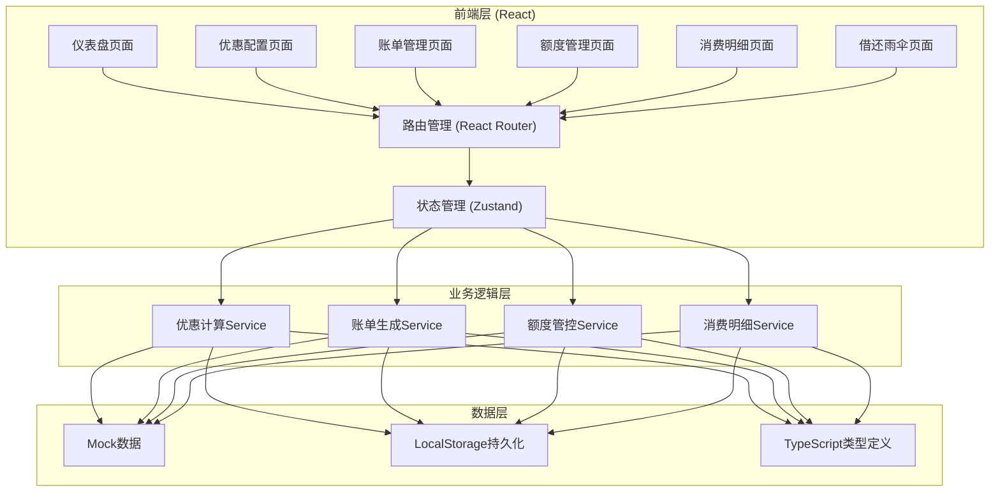
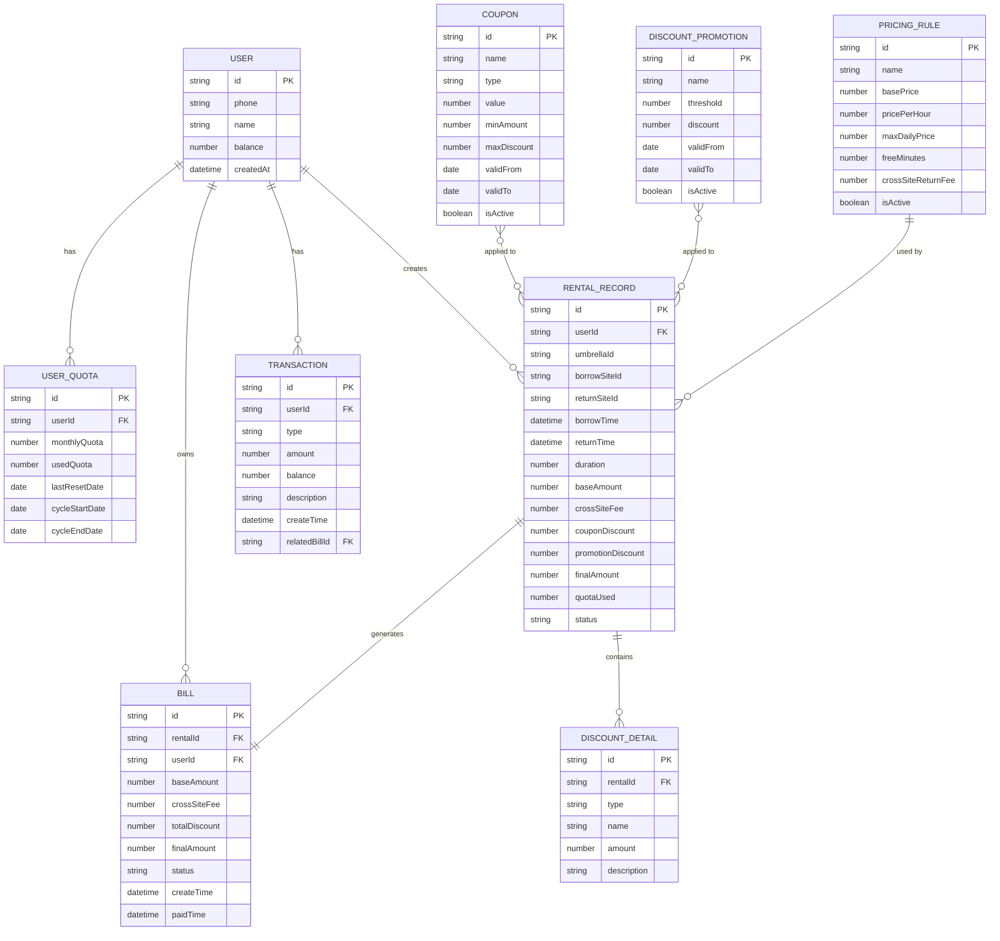

## 1. 架构设计



## 2. 技术描述

- **前端框架**：React@18.2.0 + TypeScript@5.3.0
- **构建工具**：Vite@5.0.0
- **样式方案**：TailwindCSS@3.4.0
- **状态管理**：Zustand@4.4.0
- **路由管理**：React Router@6.20.0
- **图表库**：Recharts@2.10.0
- **图标库**：Lucide React@0.294.0
- **拖拽库**：@dnd-kit/core@6.1.0 + @dnd-kit/sortable@8.0.0
- **后端**：无后端，使用Mock数据 + LocalStorage持久化
- **数据库**：LocalStorage作为本地持久化存储

## 3. 路由定义

| 路由 | 页面名称 | 模块归属 |
|------|----------|----------|
| / | 仪表盘 | 数据概览 |
| /promotion | 优惠配置 | 优惠计算模块 |
| /bills | 账单管理 | 账单生成模块 |
| /quota | 额度管理 | 额度管控模块 |
| /transactions | 消费明细 | 消费明细模块 |
| /rent | 借还雨伞 | 用户端功能 |

## 4. 核心类型定义

```typescript
// 计费规则
interface PricingRule {
  id: string;
  name: string;
  basePrice: number;
  pricePerHour: number;
  maxDailyPrice: number;
  freeMinutes: number;
  crossSiteReturnFee: number;
}

// 优惠券类型
type CouponType = 'fixed' | 'percentage' | 'free_hours';

interface Coupon {
  id: string;
  name: string;
  type: CouponType;
  value: number;
  minAmount: number;
  maxDiscount?: number;
  validFrom: string;
  validTo: string;
  isActive: boolean;
}

// 满减活动
interface DiscountPromotion {
  id: string;
  name: string;
  threshold: number;
  discount: number;
  validFrom: string;
  validTo: string;
  isActive: boolean;
}

// 优惠顺序配置
type DiscountOrder = 'coupon_first' | 'promotion_first';

interface DiscountConfig {
  order: DiscountOrder;
  allowStacking: boolean;
  negativeProtection: boolean;
}

// 用户额度
interface UserQuota {
  userId: string;
  monthlyQuota: number;
  usedQuota: number;
  lastResetDate: string;
  cycleStartDate: string;
  cycleEndDate: string;
}

// 租借记录
interface RentalRecord {
  id: string;
  userId: string;
  umbrellaId: string;
  borrowSiteId: string;
  returnSiteId?: string;
  borrowTime: string;
  returnTime?: string;
  duration?: number;
  baseAmount: number;
  crossSiteFee: number;
  couponDiscount: number;
  promotionDiscount: number;
  finalAmount: number;
  quotaUsed: number;
  status: 'ongoing' | 'completed' | 'cancelled';
  discountDetails: DiscountDetail[];
}

// 优惠明细
interface DiscountDetail {
  type: 'coupon' | 'promotion' | 'quota';
  name: string;
  amount: number;
  description: string;
}

// 账单
interface Bill {
  id: string;
  rentalId: string;
  userId: string;
  baseAmount: number;
  crossSiteFee: number;
  totalDiscount: number;
  finalAmount: number;
  status: 'pending' | 'paid' | 'refunded';
  createTime: string;
  paidTime?: string;
}

// 消费明细
interface Transaction {
  id: string;
  userId: string;
  type: 'rental' | 'recharge' | 'refund';
  amount: number;
  balance: number;
  description: string;
  createTime: string;
  relatedBillId?: string;
}
```

## 5. 数据模型

### 5.1 ER图



### 5.2 核心算法说明

#### 优惠计算算法
```typescript
function calculateFinalAmount(
  baseAmount: number,
  coupon: Coupon | null,
  promotions: DiscountPromotion[],
  config: DiscountConfig
): {
  finalAmount: number;
  couponDiscount: number;
  promotionDiscount: number;
  details: DiscountDetail[];
} {
  let currentAmount = baseAmount;
  let couponDiscount = 0;
  let promotionDiscount = 0;
  const details: DiscountDetail[] = [];

  if (config.order === 'coupon_first') {
    // 先应用优惠券
    if (coupon && coupon.isActive) {
      const discount = calculateCouponDiscount(currentAmount, coupon);
      couponDiscount = discount;
      currentAmount -= discount;
      details.push({
        type: 'coupon',
        name: coupon.name,
        amount: discount,
        description: getCouponDescription(coupon)
      });
    }
    // 后应用满减
    if (config.allowStacking) {
      const promoDiscount = calculatePromotionDiscount(currentAmount, promotions);
      promotionDiscount = promoDiscount;
      currentAmount -= promoDiscount;
      if (promoDiscount > 0) {
        details.push({
          type: 'promotion',
          name: '满减活动',
          amount: promoDiscount,
          description: '满减优惠'
        });
      }
    }
  } else {
    // 先应用满减
    const promoDiscount = calculatePromotionDiscount(currentAmount, promotions);
    promotionDiscount = promoDiscount;
    currentAmount -= promoDiscount;
    if (promoDiscount > 0) {
      details.push({
        type: 'promotion',
        name: '满减活动',
        amount: promoDiscount,
        description: '满减优惠'
      });
    }
    // 后应用优惠券
    if (config.allowStacking && coupon && coupon.isActive) {
      const discount = calculateCouponDiscount(currentAmount, coupon);
      couponDiscount = discount;
      currentAmount -= discount;
      details.push({
        type: 'coupon',
        name: coupon.name,
        amount: discount,
        description: getCouponDescription(coupon)
      });
    }
  }

  // 负值兜底校验
  if (config.negativeProtection && currentAmount < 0) {
    currentAmount = 0;
  }

  return {
    finalAmount: Math.round(currentAmount * 100) / 100,
    couponDiscount: Math.round(couponDiscount * 100) / 100,
    promotionDiscount: Math.round(promotionDiscount * 100) / 100,
    details
  };
}
```

#### 额度重置算法
```typescript
function resetMonthlyQuota(quota: UserQuota, currentDate: Date): UserQuota {
  const currentMonth = currentDate.getMonth();
  const currentYear = currentDate.getFullYear();
  const lastResetDate = new Date(quota.lastResetDate);
  
  const needsReset = 
    lastResetDate.getMonth() !== currentMonth || 
    lastResetDate.getFullYear() !== currentYear;

  if (needsReset) {
    const cycleStart = new Date(currentYear, currentMonth, 1);
    const cycleEnd = new Date(currentYear, currentMonth + 1, 0);
    
    return {
      ...quota,
      usedQuota: 0,
      lastResetDate: currentDate.toISOString().split('T')[0],
      cycleStartDate: cycleStart.toISOString().split('T')[0],
      cycleEndDate: cycleEnd.toISOString().split('T')[0]
    };
  }

  return quota;
}
```

#### 异点归还结算算法
```typescript
function calculateCrossSiteReturn(
  rental: RentalRecord,
  returnSiteId: string,
  pricingRule: PricingRule
): { crossSiteFee: number; isCrossSite: boolean } {
  const isCrossSite = rental.borrowSiteId !== returnSiteId;
  const crossSiteFee = isCrossSite ? pricingRule.crossSiteReturnFee : 0;
  
  return { crossSiteFee, isCrossSite };
}
```
